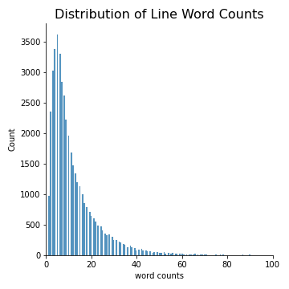
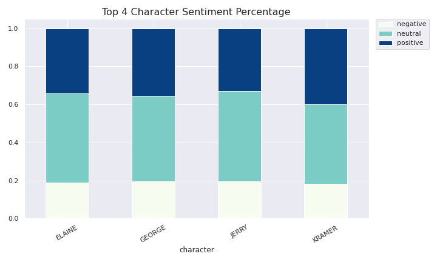
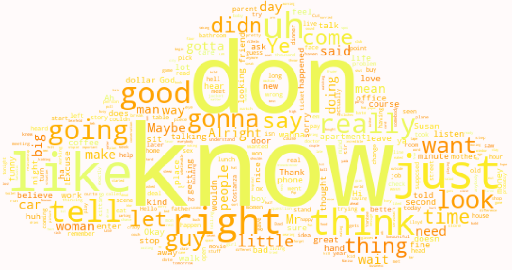
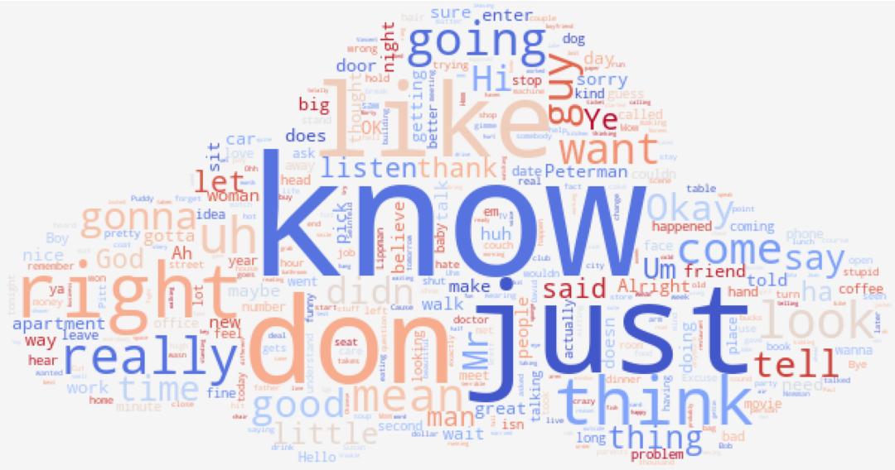

#  Seinfeld Script Generator
---
### Problem Statement

In 1996, Bill Gates wrote an essay whose title became so prevailing that every marketer knows and quotes-- "Content is King." In his essay, he believed that content "is where I expect much of the real money will be made on the Internet." Fast forward to today, his idea still stands the test of time, if not turns even truer.

We live in a world filled with content. Tehcnology has significantly lowered the bar of creating and consuming content. With the explosion of social media, the landscape of marketing has been changed completely. 10 years ago, it was fancy for a brand to have a Facebook page; now it's a must, along with a list of other must-haves: Instagram, Twitter, Pinterest, to name just a few.

To stay relevent, brands need to constantly supply content with high quality for informational or entertainment purpose, which sets a new requirment for marketers: not only do they need to generate content with great quality, they need to generate it more and fast, as well as with minimum costs possible. The good news, as Bill stated, is that "no company is too small to participate." However the question remains, how do we achieve all those? 

That is where text generation comes in. 

Recent years has witnessed series of jaw-droppping breakthroughs in the field of natural language processing, with new pre-trained NLP models producing state-of-arts results on various tasks from sentiment analysis to question answering. From a marketing's perspective, the applicatoin of text generation is endless: community engagement, developing derivatives based on an existing IP, A/B testing and so forth. Being able to utilize the text generation models will be a compelling advantage that sets the brand apart. 

This project aims to use text generation models to build a script generator for the popular 90s sitcom _Seinfeld_, with the hope to showcase marketing and operation professionals how far text generation can go and be applied with a vivid example. TV writers get paid \\$26,832 per 30-minute prime time episode. For a phenomenal show like _Seinfeld_, the price tag to hire a writer is much higher. In fact, one of the show's main writers is the leading actor Jerry Seinfeld himself, who made a staggering $13,000 per line arriving the final season of the show. Imagine that NBC would like to initiate a marketing campaign featuring reimagined _Seinfeld_ scenes, the script generator will help to afford the idea and likely achieve it faster.

Specific questions this project would like to answer:
1. Can a RNN-LSTM model be used to generate scripts with meaningful sentences in the same formality as the input data?
2. Does word level RNN-LSTM models outperfrom character level ones and why?
3. Is it possible to fine tune pre-trained GPT-2 model to generate _Seinfeld_-specific scripts? 
4. Can diversity be specified to meet different creative demands?
4. Which of the GPT-2 and RNN-LSTM perform better with regard to the form, content and speed of the script generation?
5. What are the thredholds of data size for each model?
6. Can these models be trained with a budget-friendly method?

### Contents

* [Data Aquisition and Cleaning](#data_aquisition_and_cleaning)
* [Exploratory Data Analysis](#exploratory_data_analysis)
* [Text Preprocessing](#text_preprocessing)
* [Modeling and Tuning](#modeling_and_tuning)
* [Evaluation](#evaluation)
* [Script Generator API](#script_generator_api)
* [Findings and Recommendations](#findings_and_recommendations)
* [Limitations and Next Steps](#limitations_and_next_steps)
* [Reflections](#reflections)
* [Technical Review](#technical_review)
* [System Requirements](#system_requirements)
* [References](#references)

<a id='data_aquisition_and_cleaning'></a>
### Data Aquisition and Cleaning

The data used for this project is the scripts of all season episodes of _Seinfeld_. The only data source I found that allows web scraping is Internet Movie Script Database ([IMSDb](https://www.imsdb.com/)), which is a renowned resource for movie and TV scripts. 

As the source does not have an API for scraping, I built a function to automate the web scraping process. The function is composed of three parts: 
1. Locates the dedicated page for _Seinfeld_ with the list of all episodes; 
2. Locates the dedicated pages for each episode; 
3. Scrapes scripts on each episode page.

It was not expected the data was in fact not in good shape after being scraped, considering that it was a finished product and should have a standard format that is ready to go. However, upon discovery, massive formatting errors and redundant information were staggered throughout the data. 

The best efforts have been made to tidy up the data which include: 
1. Removed datapoints that have less than occurance because these data are not likely to provide any valuable inference for the model
2. Corrected typos, redundant character names
3. Corrected misplaced lines due to the wrong formatting of the data source
4. Dropped rows where dedicated to two speakers
5. Dropped duplicate scripts

The cleaned data before feature engineering has a shape of (44,661, 3) as compared to the original shape of (54,211, 3). Most of the reduction came from duplicated lines therefore I don't believe doing this will hurt the quality of the data. 

<a id='exploratory_data_analysis'></a>
### Exploratory Data Analysis

I engineered a couple of features for EDA purposes including ```word_count```, ```sentiment_score```, ```sentiment```("positive", "negative" or "neutral"), and ```line_no_par```(lines excluding the script description inside parentheses).

Overall the average word count per line is 13 words. The distribution of the word count per line is highly skewed to the right. The max number is 399, which was expected, as the show always start with Jerry Seinfeld doing a comedy stand up which has long lines.

<table><tr>
<td>  </td>
</tr></table>

Below are the charts of top 15 characters with most lines and most line words. Not surprisingly, the four leading characters have significantly the most lines and words in the script. Jerry Seinfeld is the single character with most lines and words and led the charts by significant numbers, followed by George, Elaine and Kramer. I can also rougly concluded that the number of lines a character has is strongly correlated to the number of words spoken.

<table><tr>
<td>  </td>
</tr></table>
<table><tr>
<td>  </td>
</tr></table>

The result of sentiment analysis surprised me. Despite the display of huge differences in characters on the screen, the lines of the 4 characters showed almost identical mean and distribution of positive, neutral and negative sentiments. As indicated by the visualizations, all four of them have mostly neutral sentiment, followed by positive and then negative.

<table><tr>
<td>  </td>
</tr></table>
<table><tr>
<td>  </td>
</tr></table>

I also explored the most used words and n-grams by characters using default and custom stop words, from which I discoverd some patterns of the characters' line however didn't find much of distinctions among the characters. The characters tend to use a lot of interjection phrases such as "ha ha", "yeah", "oh", etc as well as negated expression such as "don know", "don want", "don think".

I created word clouds for each character for better visualizations. As shown below, the four characters have practically excatly the same most frequents words: "dont" "know" "like" "right".

<table><tr>
<td>  </td>
<td>  </td>
</tr></table>

<table><tr>
<td>  </td>
<td>  </td>
</tr></table>

Also it was during this process that I realized there are still some formatting erros in the data that was not possible to efficiently clean out within the time limit. Considering the amount is not too huge, I decided to work with what I had.

Upon conducting EDA, I came up with some conslusions and hypotheses:

1. The original data is a lot messier than it was expected. After performed data cleaning to my best efforts, I know there are still some noises within the data that are nearly impossible to be cleaned up entirely. Therefore I should expect some errors in my generated scripts.
2. Jerry, George, Elaine and Kramer are definite leading charaters with most lines and line words and therefore I assume that most of the model outputs will consist of dialogues among them.
3. As the average line length is 13 words, I may not want my model to learn the scripts with a number smaller than that, otherwise not enough information will be fed into the model to effectively learn. In the similar sense, considering the nature of conversations, I may not want my model to have too many lines to look at either, as that way will create noises.
4. Although I perceived distinctive personalities for the 4 leading characters from the show, I didn't see enough distinction from their lines. They have similar sentiment results and simlar word usages. If anything, Kramer may be the only one who shows slight difference from his three friends.
5. I would expect to see a lot of repetition of "meaningless" high frequency words such as "yeah yeah", "oh yeah", "don know", "don think", "don want" in the generated scripts.

<a id='text_preprocessing'></a>
### Text Preprocessing


<a id='modeling_and_tuning'></a>
### Modeling and Tuning
Character based

This is because char-based RNN LMs require much bigger hidden layer to successfully model long-term dependencies which means higher computational costs.

one of the fundamental differences between the word level and character level models is in the number of parameters the RNN has to access during the training and test. The smaller is the input and output layer of RNN, the larger needs to be the fully connected hidden layer, which makes the training of the model expensive.


Word based

|**RNN Architecture**|*Neurons*|Dropout|Parameters|*Output Shape*|
|---|---|---|---|---|
|**Embedding Layer**|None|None|400,000|*( None, 40, 40 )*|
|**LSTM 01**|512|0.1|1,132,544|*(  None, 40, 512 )*|
|**LSTM 02**|512|0.1|2,099,200|*( None, 512 )*|
|**Dense Output**|18,725|None|9,605,925|*(  None, 18725 )*|


GPT-2 Architecture

<table><tr>
<td></td>         
</tr></table>


loss --> under 1
LSTM --> 2-3 layers 
batch size -->
Steps
max sequence length

**What's New**
Built a model from scratch using bags of words rather than character based
batch generator --> address the hardware limitation
incorporated keras tokenizer
Seinfeld script generator

<a id='evaluation'></a>
### Evaluation
- loss --> should shoot for under 1, however hard to get lower 
- texts --> compare models

RNN dependency too long --> forgets but input too long then too many noise

Final thought: Seinfeld is kind of a tough text to generate from. As a general rule, text generators work better the more abstract the language.  Well, not neccarily *better* just that abstract language makes the imperfect text generation less detectable. This is why stuff like Shakespeare and poetry are popular for AI generation (Also why jazz is popular for AI music generators). People have trouble detecting flaws in less everyday language.

<a id='script_generator_api'></a>
### Script Generator API

streamlit

<table><tr>
<td></td>         
</tr></table>

<a id='text_preprocessing'></a>
### System Requirment
- RNN under py 3.7
- GPT-2 tensorflow 1.15

<a id='findings_and_recommendations'></a>
### Findings and Conclusions
- for text generation, data size is still the key?

Dataset sizes: Note that if your data is too small (1MB is already considered very small) the RNN won't learn very effectively. Remember that it has to learn everything completely from scratch. Conversely if your data is large (more than about 2MB), feel confident to increase rnn_size and train a bigger model (see details of training below). It will work significantly better. For example with 6MB you can easily go up to rnn_size 300 or even more. The biggest that fits on my GPU and that I've trained with this code is rnn_size 700 with num_layers 3 (2 is default).

business writing, legal writing etc very useful, efficient


<a id='limitations_and_next_steps'></a>
### Limitations and Next Steps
limitations
- Data not clean enough
- Loss didn't change much -- indicate that the model might be too simple -- attention model? bidirectional? Simply more training time

- GPT-2 --> too big to load, too slow to run, everytime needs to load the entire package.

- Streamlit --> how to incorporate cache to improve the performance & user experience, --> version issue: how to incorporate both models together to compare

- need more time to generate lots of texts and dive into reading to compare

next steps
- Train on jokes to make it more funny although seinfeld's jokes are very sophisticated/ insightful.

- Would be great to build in printouts during the modeling

- Figure out an automated way to read through the generated texts. Would be great to automate the counting how many words 

- Try using torch

The code is written in Torch 7, which has recently become my favorite deep learning framework. I’ve only started working with Torch/LUA over the last few months and it hasn’t been easy (I spent a good amount of time digging through the raw Torch code on Github and asking questions on their gitter to get things done), but once you get a hang of things it offers a lot of flexibility and speed. I’ve also worked with Caffe and Theano in the past and I believe Torch, while not perfect, gets its levels of abstraction and philosophy right better than others. In my view the desirable features of an effective framework are:

CPU/GPU transparent Tensor library with a lot of functionality (slicing, array/matrix operations, etc. )
An entirely separate code base in a scripting language (ideally Python) that operates over Tensors and implements all Deep Learning stuff (forward/backward, computation graphs, etc)
It should be possible to easily share pretrained models (Caffe does this well, others don’t), and crucially
NO compilation step (or at least not as currently done in Theano). The trend in Deep Learning is towards larger, more complex networks that are are time-unrolled in complex graphs. It is critical that these do not compile for a long time or development time greatly suffers. Second, by compiling one gives up interpretability and the ability to log/debug effectively. If there is an option to compile the graph once it has been developed for efficiency in prod that’s fine.

<a id='reflections'></a>
### Reflections
Deepfake: what is the boundary

Very challenging to set the model right, vectors, dimensions, shape
Output dim turns out matters? Input_dim matters too
Deepfake: what is the boundary

Not that writers can be replaced!!! but it's a latent area that can save us possible time: think about customer service: responding emails?
Data quality is not great

Transfer Learning --> if it's there, use it!

We need standards for studying bias. Language models have biases. Working out how to study these biases, discuss them, and address them, is a challenge for the AI research community. We’ve approached the challenge of bias in two ways:

<a id='technical_review'></a>
### Technical Review


<a id='system_requirements'></a>
### System Requirements

<a id='references'></a>
### References

https://colah.github.io/posts/2015-08-Understanding-LSTMs/

https://medium.com/@HeathEvans/content-is-king-essay-by-bill-gates-1996-df74552f80d9#:~:text=Ever%20wondered%20where%20the%20phrase,as%20it%20was%20in%20broadcasting.

https://towardsdatascience.com/openai-gpt-2-understanding-language-generation-through-visualization-8252f683b2f8

https://towardsdatascience.com/examining-the-transformer-architecture-part-1-the-openai-gpt-2-controversy-feceda4363bb

https://nbviewer.jupyter.org/gist/yoavg/d76121dfde2618422139

paper
http://karpathy.github.io/2015/05/21/rnn-effectiveness/

https://s3-us-west-2.amazonaws.com/openai-assets/research-covers/language-unsupervised/language_understanding_paper.pdf

https://arxiv.org/pdf/1511.06303.pdf
